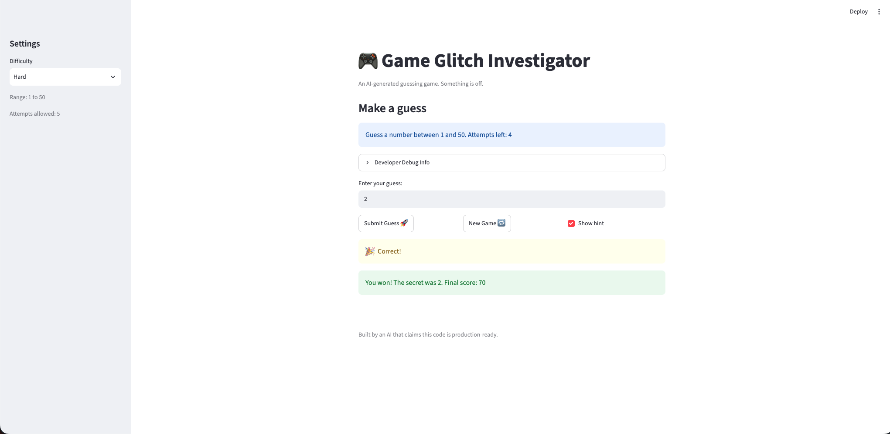

# 🎮 Game Glitch Investigator: The Impossible Guesser

## 🚨 The Situation

You asked an AI to build a simple "Number Guessing Game" using Streamlit.
It wrote the code, ran away, and now the game is unplayable. 

- You can't win.
- The hints lie to you.
- The secret number seems to have commitment issues.

## 🛠️ Setup

1. Install dependencies: `pip install -r requirements.txt`
2. Run the broken app: `python -m streamlit run app.py`

## 🕵️‍♂️ Your Mission

1. **Play the game.** Open the "Developer Debug Info" tab in the app to see the secret number. Try to win.
2. **Find the State Bug.** Why does the secret number change every time you click "Submit"? Ask ChatGPT: *"How do I keep a variable from resetting in Streamlit when I click a button?"*
3. **Fix the Logic.** The hints ("Higher/Lower") are wrong. Fix them.
4. **Refactor & Test.** - Move the logic into `logic_utils.py`.
   - Run `pytest` in your terminal.
   - Keep fixing until all tests pass!

## 📝 Document Your Experience

- [x] Describe the game's purpose.
   - The game purpose is to guess the correct number. The user can change the difficulty level and will need to guess a number within the range. They have a number of attempts determined by the range. If they guess the number correctly, they win! If not, they loose.

- [x] Detail which bugs you found.

| Input | Expected Behavior | Actual Behavior | Console Output / Error |
|-------|-------------------|-----------------|------------------------|
| When you change the difficulty in the sidenav, it does not update the low and high values in the blue box | The values to change since I updated the difficulty level | Does not change the values in the difficulty level| |
| Clicking the button `New Game` after winning or lossing does not restart a game | After winning a game, clicking on the `New Game` button updates the UI to show the user that a new has started | It gives no indication that a new game started. It forces users to refresh the app | |
| Secret is 29, Guess number is 12 | The app tells me to guess lower | the app tells me to go higher | |
| Secret is 29, Guess number is 5 | The app tells me to guess lower | the app tells me to go higher | |
| Secret is 29, Guess number is 0 | The app should not handle `0` since it is invalid input | the app tells me to go lower | |
| Secret is 29, Guess number is 900 | The app should not handle `900` since it is invalid input | the app tells me to go higher | |

- [x] Explain what fixes you applied.
   - I applied a fix for the `changing the difficulty in the sidenav` bug. The fixed involved using the `low` and `high` variables in areas in `app.py` that needed the difficulty range. I also included a unit test to address that.
   - I applied a fix for the `incorrect messaging when a user enters a guess`. The messages were swapped. When the guess is too high, tell the user to go lower. If guess is too low, tell the user to go higher. The fix involved:
      1. The secret parameter in the `check_guess` function was either a string or int which created the extra `try/catch`. Removed the type-toggling logic in app.py so that the secret is always an int
      2. Updating the logic to return the correct message

## 📸 Demo Walkthrough

Describe your fixed game in numbered steps so a reader can follow along without watching a video:

**When the secret number is 19, difficulty is Hard, and number of attempts is 5**
1. User enters a guess of `50`
2. Game returns `📉Go LOWER!`
3. User enters a guess of `30`
4. Game returns `📉Go LOWER!`
5. User enters a guess of `10`
6. Game returns `📈Go HIGHER!`
7. User enters a guess of `19`
8. Game identifies this is the correct guess
9. Game shows the user a winning message along with the message: `You won! The secret was 19. Final score: 35`

**When the user changes the difficulty range**
1. User clicks the `Developer Debug Info` tab to see the current secret they have to guess
2. User changes the difficulty range to `Hard`
3. User can see the new range difficulty reflected in the Setting Side nav and in the blue text box below `Make a guess`
4. User can see the secret got updated to a number within the range

**Screenshot** *(optional)*:


## 🧪 Test Results

```
(.venv) ➜  codepath/codepath-ai/ai110-module1show-gameglitchinvestigator-starter git:(main) python3 -m pytest
=========================================================================== test session starts ============================================================================
platform darwin -- Python 3.14.7, pytest-9.1.1, pluggy-1.6.0
rootdir: /Users/salvadorvillalonjr/Documents/pers/codepath/codepath-ai/ai110-module1show-gameglitchinvestigator-starter
plugins: anyio-4.15.1
collected 5 items                                                                                                                                                          

tests/test_game_logic.py .....                                                                                                                                       [100%]

============================================================================ 5 passed in 0.64s =============================================================================
(.venv) ➜  codepath/codepath-ai/ai110-module1show-gameglitchinvestigator-starter git:(main) ✗ 
```

## 🚀 Stretch Features

- [ ] [If you choose to complete Challenge 4, describe the Enhanced UI changes here — a screenshot is optional]

- I do not think this is listed as an enhanced feature, but I do want to call out that the UI of the initial application did not reflect the new low and high values when changing the difficulty range. I fixed this bug and added the unit tests for it. **Can this effort be considered as a Stretch Feature?**


https://github.com/user-attachments/assets/edcbaee7-a5c7-48fb-8699-6475bca094e8

